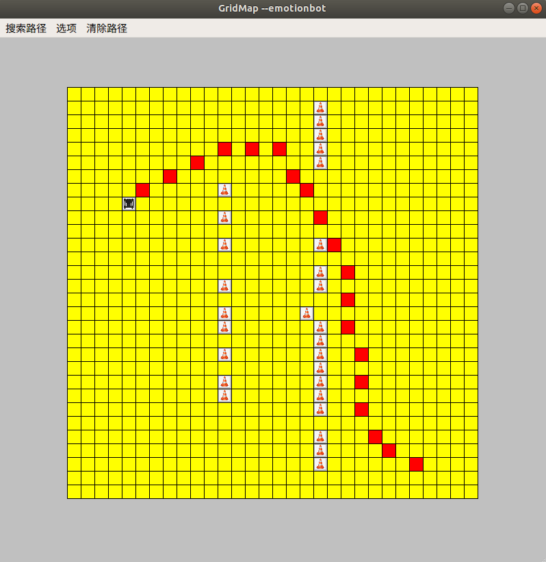
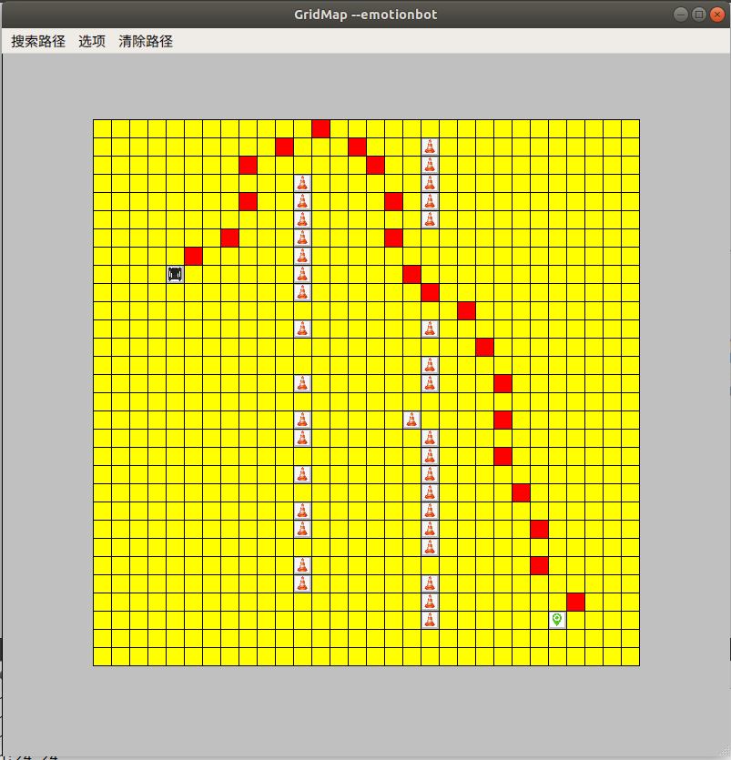
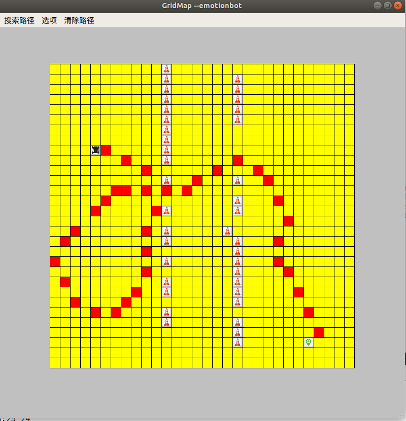

基于原A*搜路的QT工程，移植了基于open cv处理的图片展示的hybrid_a*算法而成的grid_hybrid_a*.

具体原始参考代码参考：
```
./raw_code/GridMap最新.zip   [原A*搜路的QT工程]

./raw_code/Hybrid_A_Star-main.zip

./raw_code/hybrid-astar-planning-master.zip [基于opencv处理的图片展示的hybrid_a*算法]

./raw_code/path_planner-master.zip

```

直接QT导入加载工程， 鼠标左键设置机器人或者目标点； 右键设置障碍，标题栏点击搜索

**测试效果展示：**






------------------------------------------------------------------
------------------------------------------------------------------
                           华丽的分界线 
------------------------------------------------------------------
------------------------------------------------------------------


由于受到（Shenyang Aerospace University，SAU）朱姓某博士的质疑移植的稳定性，特此开源，以正`新松`之口。 
有兴趣的的详情参照：


